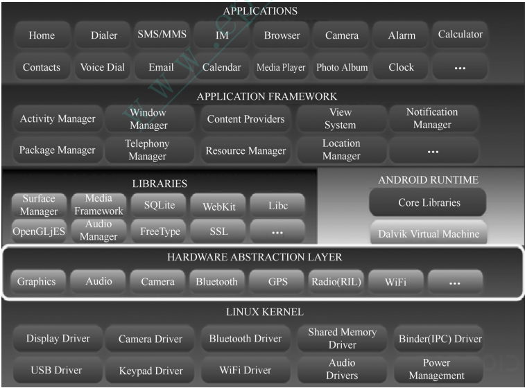

# **深入理解Android内核设计思想**
# 第一章 Android系统简介
## Android系统框架

	系统整体框架分为五层
	1 内核层
	2 硬件抽象层
	3 系统运行库层
	4 应用程序框架层
	5 应用程序层 

# 第二章 Android源码下载及编译
## Android源码下载指南【略】
### Android源码下载流程
	1.下载Repo
	$ cd ~	#进入home目录
	$ mkdir bin #创建bin目录用于存放Repo脚本
	$ PATH=~/bin:$PATH #将bin目录加入系统路径中
	$ curl https://storage.googleapis.com/git-repo-downloads/repo > ~/bin/repo 
	#curl 是一个基于命令行的文件传输工具，它支持非常多的协议。这里我们利用curl来将repo保存到相应目录下
	$ chmod a+x ~/bin/repo
	[注：网上有许多开发者(中国大陆地区)反映上面的地址经常无法成功访问。如果读者也有类似困扰，可以尝试下面这个：]
	$curl http://android.googlesource.com/repo > ~/bin/repo
	[另外，国内不少组织(特别是教育机构)也对Android镜像，如清华大学提供的开源项目(TUNA)的mirror地址如下：]
	https://aosp.tuna.tsinghua.edu.cn/
	下面是TUNA官方对Android代码库的使用帮助节选：
		1.下载 repo 工具:
			mkdir ~/bin
			PATH=~/bin:$PATH
			curl https://storage.googleapis.com/git-repo-downloads/repo > ~/bin/repo
			chmod a+x ~/bin/repo
		或者使用tuna的git-repo镜像
		使用每月更新的初始化包
		由于首次同步需要下载约 30GB 数据，过程中任何网络故障都可能造成同步失败，我们强烈建议您使用1.初始化包进行初始化。
		下载 https://mirrors.tuna.tsinghua.edu.cn/aosp-monthly/aosp-latest.tar，下载完成后记得根据 checksum.txt 的内容校验一下。
		由于所有代码都是从隐藏的 .repo 目录中 checkout 出来的，所以我们只保留了 .repo 目录，下载后解压 再 repo sync 一遍即可得到完整的目录。
		使用方法如下:
			wget -c https://mirrors.tuna.tsinghua.edu.cn/aosp-monthly/aosp-latest.tar # 下载初始化包
			tar xf aosp-latest.tar
			cd AOSP	# 解压得到的 AOSP 工程目录
			# 这时 ls 的话什么也看不到，因为只有一个隐藏的 .repo 目录
			repo sync # 正常同步一遍即可得到完整目录
			# 或 repo sync -l 仅checkout代码
		此后，每次只需运行repo sync即可保持同步。我们强烈建议您保持每天同步，并尽量选择凌晨等低峰时间
		
		传统初始化方法
		建立工作目录:
		mkdir WORKING_DIRECTORY
		cd WORKING_DIRECTORY

		初始化仓库:
		repo init -u https://aosp.tuna.tsinghua.edu.cn/platform/manifest

		如果提示无法连接到 gerrit.googlesource.com，请按如下方法设置：
		更新
		repo的运行过程中会尝试访问官方的git源更新自己，如果想使用tuna的镜像源进行更新，可以将如下内容复制到你的~/.bashrc里
		export REPO_URL='https://mirrors.tuna.tsinghua.edu.cn/git/git-repo/'
		并重启linux或者
		./bashrc或source bashrc

		如果需要某个特定的 Android 版本(列表)：
		repo init -u https://aosp.tuna.tsinghua.edu.cn/platform/manifest -b android-4.0.1_r1	
		[查看仓库所有的android版本:cd .repo/manifests => git branch -a]
		同步源码树（以后只需执行这条命令来同步）：
		repo sync
		
		2.建立次级镜像
		.repo/manifest.xml
		<manifest>

		<remote  name="aosp"
		-   fetch="https://android.googlesource.com"
		+   fetch="https://aosp.tuna.tsinghua.edu.cn"
			review="android-review.googlesource.com" />
		<remote  name="github"

		同时，修改 .repo/manifests.git/config，将
		url = https://android.googlesource.com/platform/manifest
		更新为：
		url = https://aosp.tuna.tsinghua.edu.cn/platform/manifest
		
		FAQ
	    镜像的是什么？
	    	AOSP 的 git 仓库
	    为何不能通过浏览器访问？
	    	暂时没有 gitweb, 而且反正是 git bare 仓库，没有可以直接看到的内容。
	    出现 curl: (22) The requested URL returned error: 404 Not Found Server does not provide clone.bundle; ignoring. 怎么办？
	    无视即可

		3.下载源码
		$ repo sync
		更新经常出现的问题
		http://source.android.com/source/known-issues.html
		Android系统本身是由非常多的子项目组成的，这也是为什么我们需要repo来统一管理AOSP源码的一个重要原因。

		当我们使用repo init命令初始化AOSP工程时，会在当前目录下生成一个repo文件夹。

## 原生Android系统编译指南	
	1.建立交叉编译环境
	交叉编译器		宿主机	 		 	目标机
	arm-elf-gcc		X86PC(windows)		Arm

	2.安装jdk
	sudo apt-get install openjdk-8-jdk
	sudo apt-get install openjdk-8-jre
	
	3.安装编译android源码需要的一些依赖
	sudo apt-get install libx11-dev:i386 libreadline6-dev:i386 libgl1-mesa-dev g++-multilib 
	sudo apt-get install -y git flex bison gperf build-essential libncurses5-dev:i386 
	sudo apt-get install tofrodos python-markdown libxml2-utils xsltproc zlib1g-dev:i386 
	sudo apt-get install dpkg-dev libsdl1.2-dev libesd0-dev 
	sudo apt-get install git-core gnupg flex bison gperf build-essential 
	sudo apt-get install zip curl zlib1g-dev gcc-multilib g++-multilib 
	sudo apt-get install libc6-dev-i386 
	sudo apt-get install lib32ncurses5-dev x11proto-core-dev libx11-dev 
	sudo apt-get install libgl1-mesa-dev libxml2-utils xsltproc unzip m4 
	sudo apt-get install lib32z-dev ccache

	4.设立ccache[可选]
	如果你经常执行"make clean",或者需要经常编译不同的产品类别，那么ccache还是有用的。它可以作为编译时的缓冲，
	从而加快重新编译的速度。
	首先在.bashrc中加入如下命令
	export USE_CCACHE=1
	如果你的home目录是非本地的文件系统(如NFS)，那么需要特别指定(默认情况下它存放于~/.ccache):
	export CCACHE_DIR=<path-to-your-ccache-directory>
	在源码下载完成后，必须在源码中找到如下路径并执行命令：
	prebuilt/linux-x86/ccache/ccache -M 50G
	#推荐的值为50-100G，你可以实际情况进行设置
	
	5.配置USB访问权限
	USB的访问权限在我们对实际设备进行操作时是必不可少的(如下载系统程序包到设备上)，在ubuntu系统中，这一权限通常需要特别的配置才能获得。
	可以通过修改/etc/udev/rules.d/51-android.rules来达到目的。
	#adb protocol on passion (Nexus One)
	SUBSYSTEM=="usb",ATTR(idVendor)=="18d1",ATTR(idProduct)=="4e12",MODE="0660",OWNER="<username>"
	#fastboot protocol on passion(nexus One)
	<SUBSYSTEM="usb",ATTR{idVendor}=='Obb4' ATTR(idProduct)=="OFFF",MODE="0660" OWNER="<username>"
	...

### 编译流程
	Step1.执行envsetup脚本
	