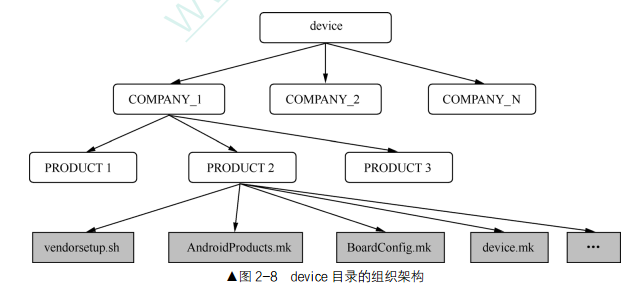
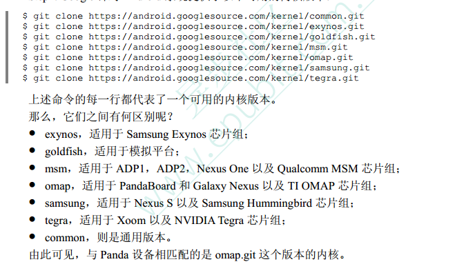
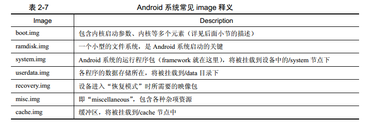
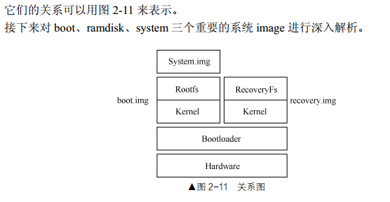
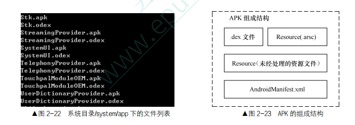

# **深入理解Android内核设计思想**
# 第一章 Android系统简介
## Android系统框架

	系统整体框架分为五层
	1 内核层
	2 硬件抽象层
	3 系统运行库层
	4 应用程序框架层
	5 应用程序层 

# 第二章 Android源码下载及编译
## Android源码下载指南【略】
### Android源码下载流程
	1.下载Repo
	$ cd ~	#进入home目录
	$ mkdir bin #创建bin目录用于存放Repo脚本
	$ PATH=~/bin:$PATH #将bin目录加入系统路径中
	$ curl https://storage.googleapis.com/git-repo-downloads/repo > ~/bin/repo 
	#curl 是一个基于命令行的文件传输工具，它支持非常多的协议。这里我们利用curl来将repo保存到相应目录下
	$ chmod a+x ~/bin/repo
	[注：网上有许多开发者(中国大陆地区)反映上面的地址经常无法成功访问。如果读者也有类似困扰，可以尝试下面这个：]
	$curl http://android.googlesource.com/repo > ~/bin/repo
	[另外，国内不少组织(特别是教育机构)也对Android镜像，如清华大学提供的开源项目(TUNA)的mirror地址如下：]
	https://aosp.tuna.tsinghua.edu.cn/
	下面是TUNA官方对Android代码库的使用帮助节选：
		1.下载 repo 工具:
			mkdir ~/bin
			PATH=~/bin:$PATH
			curl https://storage.googleapis.com/git-repo-downloads/repo > ~/bin/repo
			chmod a+x ~/bin/repo
		或者使用tuna的git-repo镜像
		使用每月更新的初始化包
		由于首次同步需要下载约 30GB 数据，过程中任何网络故障都可能造成同步失败，我们强烈建议您使用1.初始化包进行初始化。
		下载 https://mirrors.tuna.tsinghua.edu.cn/aosp-monthly/aosp-latest.tar，下载完成后记得根据 checksum.txt 的内容校验一下。
		由于所有代码都是从隐藏的 .repo 目录中 checkout 出来的，所以我们只保留了 .repo 目录，下载后解压 再 repo sync 一遍即可得到完整的目录。
		使用方法如下:
			wget -c https://mirrors.tuna.tsinghua.edu.cn/aosp-monthly/aosp-latest.tar # 下载初始化包
			tar xf aosp-latest.tar
			cd AOSP	# 解压得到的 AOSP 工程目录
			# 这时 ls 的话什么也看不到，因为只有一个隐藏的 .repo 目录
			repo sync # 正常同步一遍即可得到完整目录
			# 或 repo sync -l 仅checkout代码
		此后，每次只需运行repo sync即可保持同步。我们强烈建议您保持每天同步，并尽量选择凌晨等低峰时间
		
		传统初始化方法
		建立工作目录:
		mkdir WORKING_DIRECTORY
		cd WORKING_DIRECTORY

		初始化仓库:
		repo init -u https://aosp.tuna.tsinghua.edu.cn/platform/manifest

		如果提示无法连接到 gerrit.googlesource.com，请按如下方法设置：
		更新
		repo的运行过程中会尝试访问官方的git源更新自己，如果想使用tuna的镜像源进行更新，可以将如下内容复制到你的~/.bashrc里
		export REPO_URL='https://mirrors.tuna.tsinghua.edu.cn/git/git-repo/'
		并重启linux或者
		./bashrc或source bashrc

		如果需要某个特定的 Android 版本(列表)：
		repo init -u https://aosp.tuna.tsinghua.edu.cn/platform/manifest -b android-4.0.1_r1	
		[查看仓库所有的android版本:cd .repo/manifests => git branch -a]
		同步源码树（以后只需执行这条命令来同步）：
		repo sync
		
		2.建立次级镜像
		.repo/manifest.xml
		<manifest>

		<remote  name="aosp"
		-   fetch="https://android.googlesource.com"
		+   fetch="https://aosp.tuna.tsinghua.edu.cn"
			review="android-review.googlesource.com" />
		<remote  name="github"

		同时，修改 .repo/manifests.git/config，将
		url = https://android.googlesource.com/platform/manifest
		更新为：
		url = https://aosp.tuna.tsinghua.edu.cn/platform/manifest
		
		FAQ
	    镜像的是什么？
	    	AOSP 的 git 仓库
	    为何不能通过浏览器访问？
	    	暂时没有 gitweb, 而且反正是 git bare 仓库，没有可以直接看到的内容。
	    出现 curl: (22) The requested URL returned error: 404 Not Found Server does not provide clone.bundle; ignoring. 怎么办？
	    无视即可

		3.下载源码
		$ repo sync
		更新经常出现的问题
		http://source.android.com/source/known-issues.html
		Android系统本身是由非常多的子项目组成的，这也是为什么我们需要repo来统一管理AOSP源码的一个重要原因。

		当我们使用repo init命令初始化AOSP工程时，会在当前目录下生成一个repo文件夹。

## 原生Android系统编译指南	
	1.建立交叉编译环境
	交叉编译器		宿主机	 		 	目标机
	arm-elf-gcc		X86PC(windows)		Arm

	2.安装jdk
	sudo apt-get install openjdk-8-jdk
	sudo apt-get install openjdk-8-jre
	
	3.安装编译android源码需要的一些依赖
	sudo apt-get install libx11-dev:i386 libreadline6-dev:i386 libgl1-mesa-dev g++-multilib 
	sudo apt-get install -y git flex bison gperf build-essential libncurses5-dev:i386 
	sudo apt-get install tofrodos python-markdown libxml2-utils xsltproc zlib1g-dev:i386 
	sudo apt-get install dpkg-dev libsdl1.2-dev libesd0-dev 
	sudo apt-get install git-core gnupg flex bison gperf build-essential 
	sudo apt-get install zip curl zlib1g-dev gcc-multilib g++-multilib 
	sudo apt-get install libc6-dev-i386 
	sudo apt-get install lib32ncurses5-dev x11proto-core-dev libx11-dev 
	sudo apt-get install libgl1-mesa-dev libxml2-utils xsltproc unzip m4 
	sudo apt-get install lib32z-dev ccache

	4.设立ccache[可选]
	如果你经常执行"make clean",或者需要经常编译不同的产品类别，那么ccache还是有用的。它可以作为编译时的缓冲，
	从而加快重新编译的速度。
	首先在.bashrc中加入如下命令
	export USE_CCACHE=1
	如果你的home目录是非本地的文件系统(如NFS)，那么需要特别指定(默认情况下它存放于~/.ccache):
	export CCACHE_DIR=<path-to-your-ccache-directory>
	在源码下载完成后，必须在源码中找到如下路径并执行命令：
	prebuilt/linux-x86/ccache/ccache -M 50G
	#推荐的值为50-100G，你可以实际情况进行设置
	
	5.配置USB访问权限
	USB的访问权限在我们对实际设备进行操作时是必不可少的(如下载系统程序包到设备上)，在ubuntu系统中，这一权限通常需要特别的配置才能获得。
	可以通过修改/etc/udev/rules.d/51-android.rules来达到目的。
	#adb protocol on passion (Nexus One)
	SUBSYSTEM=="usb",ATTR(idVendor)=="18d1",ATTR(idProduct)=="4e12",MODE="0660",OWNER="<username>"
	#fastboot protocol on passion(nexus One)
	<SUBSYSTEM="usb",ATTR{idVendor}=='Obb4' ATTR(idProduct)=="OFFF",MODE="0660" OWNER="<username>"
	...

### 编译流程
	Step1.执行envsetup脚本
	$ source ./build/envsetup.sh

	Step2. 选择编译目标
	$ lunch BUILD_BUILDTYPE

	Step3. 执行编译命令
	$ make [-jN] N 的值取决于开发机器的 CPU数、每颗 CPU 的核心数以及每个核心的线程数。

	小技巧【Build Number标签】
	$ export BUILD_NUMBER=${USER}-'date +%Y%m%d-%H%M%S'

	编译SDK：
	Mac OS和Linux
	1.下载源码，和前面已经讲过的源码下载过程没有任何区别。
	2.执行 envsetup.sh
	3.选择 SDK 对应的产品
	$ lunch sdk-eng
	$ make sdk

### 定制产品的编译与烧录
#### 定制新产品
	Step 1. 和图 2-6 所列的各厂商一样，我们也最好先在 device 目录下添加一个以公司命名的文件夹。
	device：
	samsung、 moto、 google 等厂商名录

	讲解脚本文件
	Step 2. vendorsetup.sh

* 虽然我们已经为新产品创建了目录，但 Android 系统并不知道它的存在——所以需要主动告知
	Android 系统新增了一个“家庭成员”。以三星 toro 为例，为了让它能被正确添加到编译系统中，首
	先就要在其目录下新建一个 vendorsetup.sh 脚本。这个脚本通常只需要一个语句。具体范例如下：
	add\_lunch\_combo full\_toro-userdebug
	大家应该还记得前一小节编译原生态系统的第一步是执行 envsetup.sh，函数 add_lunch_combo
	就是在这个文件中定义的。此函数的作用是将其参数所描述的产品（如 full\_toro-userdebug）添加
	到系统相关变量中——后续 lunch 提供的选单即基于这些变量产生的。那么， vendorsetup.sh 在什么时候会被调用呢？
	答案也是 envsetup.sh。这个脚本的大部分内容是对各种函数进行定义与实现，末尾则会通过
	一个 for 循环来扫描工程中所有可用的 vendorsetup.sh，并执行它们。具体源码如下：
#
	# Execute the contents of any vendorsetup.sh files we can find.
	for f in 'test -d device && find device -maxdepth 4 -name 'vendorsetup.sh' 2> /dev/null'
	\
	'test -d vendor && find vendor -maxdepth 4 -name 'vendorsetup.sh' 2> /dev/null'
	do
	echo "including $f"
	. $f
	Done
	unset f
	可见，默认情况下编译系统会扫描如下路径来查找 vendorsetup.sh：
	/vendor/
	/device/
	注： vendor 这个目录在 4.3 版本的 Android 工程中已经不存在了，建议开发者将产品目录统
	一放在 device 中。

#
	Step 3. 添加 AndroidProducts.mk。
* 消费者在货架上选择（lunch）了某样“商品”后，工作人
员的后续操作（如结账、售后等）就完全基于这个特定商品来展开。编译系统会先在商品所在目
录下寻找 AndroidProducts.mk 文件，这里记录着针对该款商品的一些具体属性。不过，通常我们
只在这个文件中做一个“转向”。如：
#
	/*device/samsung/toro/AndroidProducts.mk*/
	PRODUCT_MAKEFILES := \
	$(LOCAL_DIR)/aosp_toro.mk \
	$(LOCAL_DIR)/full_toro.mk
* 因为 AndroidProducts.mk 对于每款产品都是通用的，不利于维护管理，所以可另外新增一个
或者多个以该产品命名的 makefile（如 full\_toro.mk 和 aosp\_toro.mk），再让前者通过 PRODUCT_
MAKEFILES“指向”它们。

#
	Step4. 实现上一步所提到的某产品专用的 makefile 文件
#
	Step 5. 添加 BoardConfig.mk 文件
*	这个文件用于填写目标架构、硬件设备属性、编译器的条
件标志、分区布局、 boot 地址、 ramdisk 大小等一系列参数（参见下一小节对系统映像文件的讲解）。
下面是一个范例（因为 toro 中的 BoardConfig 主要引用了 tuna 的 BoardConfig 实现，所以我们直
接讲解后者的实现）：

#
	Step 6. 添加 Android.mk。这是 Android 系统下编译某个模块的标准 makefile
#
	Step7. 完成前面 6 个步骤后，我们就成功地将一款新设备定制到编译系统中了。
* /system/build.prop 这个文件的生成过程也是由编译系统控制的。具体处理过程在/build/core/Makefile 中，它主要由以下几个部分组成：
#
	/build/tools/buildinfo.sh
	这个脚本用于向 build.prop 中输出各种<key> <value>组合，实现方式也很简单。下面是其中的两行节选：
	echo "ro.build.id=$BUILD_ID"
	echo "ro.build.display.id=$BUILD_DISPLAY_ID"
	y TARGET_DEVICE_DIR 目录下的 system.prop
	y ADDITIONAL_BUILD_PROPERTIES
	y /build/tools/post_process_props.py

### 2.3.2 Linux 内核编译
	Step1. 首先通过以下命令来获取到 git log：
	$ git clone https://android.googlesource.com/device/ti/panda
	$ cd panda
	$git log --max-count=1 kernel
#
	Step2. Google 针对 Android 系统提供了以下可用的内核版本：

	Step3. 除了 Linux 内核，我们还需要下载 prebuilt。具体命令如下：
	$ git clone https://android.googlesource.com/platform/prebuilt
	$ export PATH=$(pwd)/prebuilt/linux-x86/toolchain/arm-eabi-4.4.3/bin:$PATH
#
	Step4. 完成以上步骤后，就可以进行 Panda 内核的编译了：
	$ export ARCH=arm
	$ export SUBARCH=arm
	$ export CROSS_COMPILE=arm-eabi-
	$ cd omap
	$ git checkout <第一步获取到的值>
	$ make panda_defconfig
	$ make

### 2.3.3 烧录/升级系统
	（1） SD 卡工厂烧录方式
	（2） USB 方式
	（3）专用的烧写工具
	（4）网络连接方式
	（5）设备 Bootloader+fastboot 的模式
	（6） Recovery 模式
	
## 2.4 Android Multilib Build

## 2.5 Android系统映像文件

## 2.6 ODEx
* ODEX 是 Android 旧系统的一个优化机制。对于很多开发人员来说， ODEX 可以说是既熟悉
又陌生。熟悉的原因在于目前很多手机系统， 或者 APK 中的文件都从以前的格式变成了如图 2-21
和图 2-22 所示的样子。

* 本书的 Android 应用程序编译和打包章节将做更为详细介绍。现在大家只要知道 APK 中有哪
些组成元素就可以了。当应用程序启动时，系统需要提取图 2-23 中的 dex（如果之前没有做过
ODEX 优化的话，或者/data/dalvik-cache 中没有对应的 ODEX 缓存），然后才能执行加载动作。而
ODEX 则是预先将 DEX 提取出来，并针对当前具体设备做了优化工作后的产物，这样做除了能
提高加载速度外，还有如下几个优势：